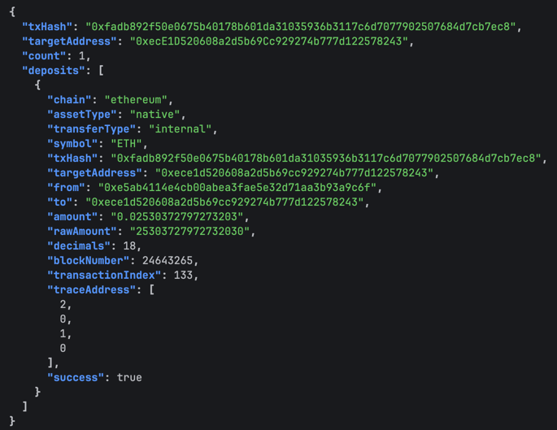
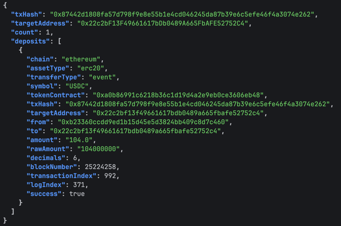
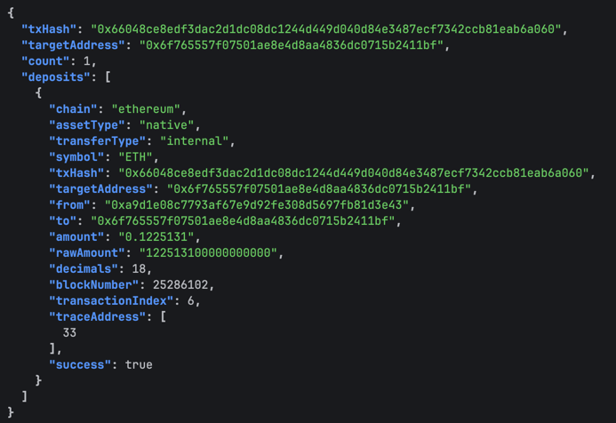
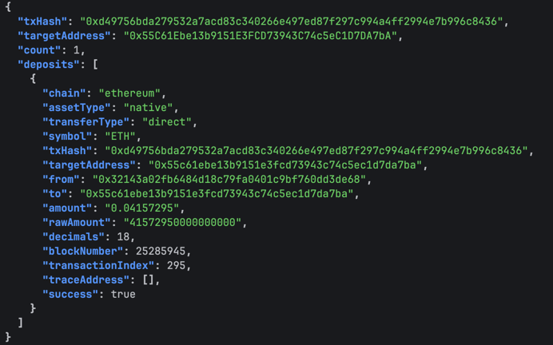

# Ethereum Deposit Parser

이더리움 메인넷에서 트랜잭션 해시와 대상 주소가 주어졌을 때, 해당 트랜잭션 안에서 대상 주소로 입금된 자산을 파싱하는 서비스입니다.

---

## 🔧 1. 프로젝트 빌드 및 실행 방법

### 사전 요구사항

| 도구 | 버전 |
|---|---|
| Node.js | 18+ |
| npm | 9+ |

### Node.js 설치 (미설치 시)

```bash
brew install node
node -v   # v18+ 확인
```

### 의존성 설치

```bash
npm install
```

### 환경변수 설정
```bash
.env 생성 후 .env.example 내용을 복사
```
| 변수 | 설명                                               |
|---|--------------------------------------------------|
| `RPC_HTTP_URL` | Alchemy Ethereum Mainnet HTTP 엔드포인트 (유료 RPC API) |

### 서버 실행

```bash
npm start
```

정상 기동 시 출력:

```
Server running on http://localhost:3000
Press Ctrl+C to stop
```

### API 사용 예시

```bash
# test case 1
curl -s "http://localhost:3000/deposit?txHash=0xfadb892f50e0675b40178b601da31035936b3117c6d7077902507684d7cb7ec8&targetAddress=0xecE1D520608a2d5b69Cc929274b777d122578243" | jq
# test case 2
curl -s "http://localhost:3000/deposit?txHash=0x87442d1808fa57d798f9e8e55b1e4cd046245da87b39e6c5efe46f4a3074e262&targetAddress=0x22c2bF13F49661617bDb0489A665FbAFE52752C4" | jq
# test case 3
curl -s "http://localhost:3000/deposit?txHash=0x66048ce8edf3dac2d1dc08dc1244d449d040d84e3487ecf7342ccb81eab6a060&targetAddress=0x6f765557f07501ae8e4d8aa4836dc0715b2411bf" | jq
# test case 4
curl -s "http://localhost:3000/deposit?txHash=0xd49756bda279532a7acd83c340266e497ed87f297c994a4ff2994e7b996c8436&targetAddress=0x55C61Ebe13b9151E3FCD73943C74c5eC1D7DA7bA" | jq
```

### 테스트 결과
- test case 1


- test case 2


- test case 3


- test case 4




### 에러 케이스

| 상황 | HTTP 상태 | 메시지 |
|---|---|---|
| `txHash` 누락 | `400` | txHash query parameter is required |
| `targetAddress` 누락 | `400` | targetAddress query parameter is required |
| `txHash` 형식 오류 | `400` | txHash must be a valid 32-byte hex string |
| `targetAddress` 형식 오류 | `400` | targetAddress must be a valid Ethereum address |
| RPC / 노드 오류 | `500` | 에러 메시지 |

---

## 🏗️ 2. 아키텍처

### 전체 구조 다이어그램

```
┌─────────────────────────────────────────┐
│         Client (curl / 앱)               │
└────────────────┬────────────────────────┘
                 │ HTTP GET /deposit?txHash=...&targetAddress=...
                 ▼
┌─────────────────────────────────────────┐
│           controller.ts                 │
│   • 쿼리 파라미터 유효성 검사                 │
│   • GET /deposit 라우트 등록               │
└────────────────┬────────────────────────┘
                 │
                 ▼
┌─────────────────────────────────────────┐
│            service.ts                   │
│   parseEthereumDeposit(txHash, target)  │
│   • RPC 3종 병렬 호출                      │
│   • 파서 3종 결과 병합 후 반환                │
└──────┬──────────────┬───────────────────┘
       │              │
       ▼              ▼
┌────────────┐  ┌─────────────────────────┐
│ rpc-client │  │       parser.ts         │
│    .ts     │  │                         │
│            │  │  parseDirectEth()       │
│ • getTx    │  │  • tx.to === target     │
│ • getRecei │  │  • tx.value > 0         │
│   pt       │  │                         │
│ • getCall  │  │  parseInternalEth()     │
│   Trace    │  │  • callTracer DFS 재귀   │
│            │  │  • CALL/CALLCODE만 처리   │
│  Alchemy   │  │  • revert 케이스 제외      │
│  RPC 호출   │  │                         │
└────────────┘  │  parseErc20Deposits()   │
                │  • Transfer 이벤트 로그    │
                │  • USDT / USDC 필터링     │
                └─────────────────────────┘
```


### 디렉토리 구조

```
eth_deposit_parser/
├── src/
│   └── app/
│       ├── main.ts                   # Express 서버 진입점
│       ├── controller.ts             # GET /deposit 라우트 + 입력 검증
│       ├── service.ts                # parseEthereumDeposit() — 파서 통합 호출
│       ├── parser.ts                 # parseDirectEth / parseInternalEth / parseErc20Deposits
│       ├── rpc-client.ts             # Alchemy RPC 호출 래퍼 (provider 포함)
│       ├── types.ts                  # ParsedDepositResult, RpcTransaction 등 타입 정의
│       └── constants.ts              # USDT/USDC 주소, Transfer 이벤트 토픽 등 상수
├── .env                              # RPC URL (gitignore)
├── package.json
├── tsconfig.json
└── README.md
```

### 기술 스택

| 영역 | 기술 |
|---|---|
| 언어 | TypeScript (Node.js 18+) |
| HTTP 프레임워크 | Express 5 |
| 이더리움 라이브러리 | ethers.js v6 |
| RPC 제공자 | Alchemy Ethereum Mainnet |
| 환경변수 | dotenv |

### 입금 감지 방식 3종

| transferType | 감지 방법 | 사용 API |
|---|---|---|
| `direct` | `tx.to === targetAddress && tx.value > 0` | `eth_getTransactionByHash` |
| `internal` | callTracer  DFS 재귀 순회 | `debug_traceTransaction` |
| `event` | Transfer(from, to, amount) 이벤트 로그 필터 | `eth_getTransactionReceipt` |

---

## 🔍 3. RPC API 명세

### 사용 API 목록

| API | 용도 | 플랜 요구사항 |
|---|---|---|
| `eth_getTransactionByHash` | 트랜잭션 기본 정보 조회 (from, to, value) | 무료 |
| `eth_getTransactionReceipt` | 실행 결과 및 이벤트 로그 조회 | 무료 |
| `debug_traceTransaction` | Internal ETH 전송 콜트리 조회 (callTracer) | **유료 (Pay As You Go+)** |

### `debug_traceTransaction` callTracer 응답 구조

Internal ETH 입금 감지는 `debug_traceTransaction` 의 `callTracer` 옵션으로 반환되는 콜트리를 재귀 순회하여 탐지합니다.

```json
{
  "type": "CALL",
  "from": "0xSender",
  "to": "0xContract",
  "value": "0x...",
  "calls": [
    {
      "type": "CALL",
      "from": "0xContract",
      "to": "0xTargetAddress",
      "value": "0x1BC16D674EC80000"
    }
  ]
}
```

**파싱 규칙:**
- `type === 'CALL' || type === 'CALLCODE'` 인 프레임만 ETH 전송 대상으로 처리
  - `DELEGATECALL` / `STATICCALL` 은 ETH 전송 불가
  - `CREATE` / `CREATE2` 는 새 컨트랙트 주소로만 ETH 전달
- `frame.error` 가 있으면 revert된 콜 → 입금 제외
- 루트 프레임은 tx 자체이므로 `direct` 로 처리하고 Internal 스캔에서 제외
- `traceAddress` 는 콜트리 내 경로 인덱스 배열 (예: `[2, 0, 1, 0]`)

---

## 📦 4. 사용 라이브러리 및 API


| 구분 | 항목 | 사용 여부 | 용도 |
|---|---|---|---|
| **Library** | `ethers.js` Provider | ✅ | JSON-RPC 호출, BigInt 단위 변환 |
| **API** | `eth_getTransactionByHash` | ✅ | tx 기본 정보 조회 (from, to, value) |
| **API** | `eth_getTransactionReceipt` | ✅ | 실행 결과 및 Transfer 이벤트 로그 조회 |
| **API** | `debug_traceTransaction` (callTracer) | ✅ | Internal ETH 전송 콜트리 조회 |

---

## 🔌 5. RPC Provider 및 Trace/Debug API

### RPC Provider

**Alchemy** 유료 API 사용

ethers.js `JsonRpcProvider`로 연결하며, 모든 데이터 조회는 HTTP JSON-RPC 단건 요청으로 처리합니다. 


### `debug_traceTransaction` — callTracer 방식

Internal ETH 입금은 `debug_traceTransaction`에 `callTracer` 옵션을 사용해 트랜잭션 전체 콜트리를 가져온 뒤, `calls` 배열을 DFS로 재귀 순회하여 탐지합니다.

```json
{
  "type": "CALL",
  "from": "0xContract",
  "to": "0xTargetAddress",
  "value": "0x1BC16D674EC80000",
  "calls": [...]
}
```

**파싱 규칙:**
- `type === 'CALL' || type === 'CALLCODE'` 프레임만 처리 — `DELEGATECALL` / `STATICCALL` / `CREATE` 는 ETH 전송 불가
- `frame.error` 존재 시 revert된 콜 → 입금 제외
- 루트 프레임은 tx 자체(`direct`)이므로 Internal 스캔에서 제외
- `traceAddress`는 콜트리 내 경로 인덱스 배열 (예: `[2, 0, 1, 0]`)

---

## 🤖 6. AI 협업 로그

- **도구**: Claude Code

---

### 1. HTTP API 구조 전환 — 하드코딩 제거

**배경**: 초기 구현은 테스트 케이스 4개가 코드 내 고정값으로 작성되어 있었고, 순차 실행 후 콘솔 출력하는 구조였다.

**전환 결정**: `txHash` / `targetAddress` 를 GET 쿼리 파라미터로 받는 HTTP API 구조로 변경. controller — service 레이어 분리.

**결과**:
- 고정값 완전 제거, 임의의 트랜잭션/주소 조합을 동적으로 처리 가능
- 입력값 유효성 검사 (hex 형식, 길이) controller 레이어에서 처리

---

### 2. Internal ETH 파싱 — Trace API 제약 대응

**상황**: `debug_traceTransaction` 이 Alchemy 무료 플랜에서 차단됨.

**초기 대응**: `getCallTrace` 가 null 을 반환하면 `parseInternalEth` 는 빈 배열 반환하는 graceful fallback 구현. 유료 플랜 전환 후 실제 callTracer 응답으로 재귀 순회 동작 확인.

**파싱 핵심**: `calls` 배열을 DFS로 재귀 순회하며 `to === targetAddress && value > 0 && !error` 조건을 만족하는 CALL 프레임만 수집.

---

### 3. 파일 구조 리팩터

**내 요청**: 유사 기능 파일 통합 / 레이어 책임 분리

**변경 내용**:

| 변경 | 이유 |
|---|---|
| `provider.ts` + `rpc.ts` → `rpc-client.ts` | provider 초기화와 RPC 호출이 동일 레이어 |
| `types.ts` + `constants.ts` 분리 유지 | 타입 정의와 상숫값은 성격이 다름 |
| `ethereum-deposit.parser.ts` → `parser.ts` | 파일명 간소화 |
| GET 라우트를 `main.ts` → `controller.ts` 로 이동 | 라우트 정의는 controller 책임 |

---

### 4. `normalizeAddress` 제거

**내 지적**: 단순 `toLowerCase()` 래퍼 함수는 불필요한 추상화.

**변경**: `normalizeAddress(x)` 호출부 전체를 `x.toLowerCase()` 로 인라인 치환. 함수 삭제.

---

### 5. `walk` → `collectInternalDeposits` 리네임

**내 지적**: `walk` 는 DFS 순회 관용 이름이지만, 이 함수가 무엇을 하는지 이름에서 드러나지 않는다.

**변경**: 함수명을 `collectInternalDeposits` 로 변경. `isEthCall` → `isEthTransferCall` 도 함께 명확화.

---

### 6. revert된 트랜잭션 입금 제외 — tx 레벨 성공 체크 추가

**지적 내용**: `frame.error` 체크는 서브콜 레벨 revert만 잡는다. `receipt.status === '0x0'`인 경우(tx 전체 revert)는 EVM이 모든 상태 변화를 롤백하므로 ETH 이동·로그가 실제로 일어나지 않았는데, 파서 세 개 모두 이를 체크하지 않아 있지도 않은 입금을 결과에 포함할 수 있다.

**결정**: 각 파서에 개별 가드를 추가하는 대신 `service.ts`에서 파서 호출 전 한 번만 체크.

```typescript
if (receipt.status !== '0x1') return [];
```

**이유**: tx 전체가 revert됐으면 internal이든 ERC-20이든 실제로 일어난 일이 없으므로, 파서 호출 자체를 막는 것이 논리적으로 맞고 중복 가드도 불필요.

---

### 7. `getTransactionReceipt` 재시도 로직 추가

**배경**: 트랜잭션이 아직 채굴 중이거나 노드 동기화가 늦은 경우 receipt가 null로 올 수 있다. 기존 코드는 null이면 즉시 에러를 던졌다.

**결정**: 1초 간격으로 최대 3회 재시도 후 그래도 없으면 에러 반환.

```typescript
for (let i = 0; i < retries; i++) {
  const receipt = await provider.send('eth_getTransactionReceipt', [txHash]);
  if (receipt) return receipt;
  if (i < retries - 1) await new Promise(r => setTimeout(r, intervalMs));
}
throw new Error(`Receipt not found after ${retries} retries: ${txHash}`);
```

**트레이드오프**: 노드 응답 지연 시 API 응답이 최대 3초 늦어질 수 있으나, receipt를 못 가져와 에러를 반환하는 것보다 낫다.

---

### AI 제안을 채택하지 않은 사례

| AI 제안 | 최종 결정 | 이유 |
|---|---|---|
| `trace_transaction` (Parity) fallback 추가 | Alchemy 단일 RPC 유지 | Alchemy 무료 플랜에서 Parity trace도 동일하게 차단됨 |
| 4개 파일을 `ethereum.ts` 하나로 통합 | `types.ts` / `constants.ts` / `rpc-client.ts` 분리 유지 | 타입, 상수, RPC 레이어는 서로 다른 성격 |
| `parseInternalEth` 빈 배열 stub 유지 | 재귀 순회 로직 구현 | Trace API 미지원은 런타임 조건이지 구현 누락이 아님 |
